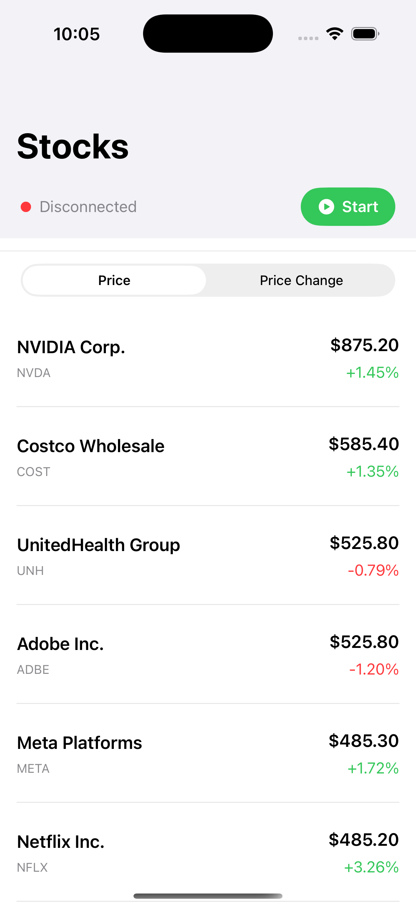
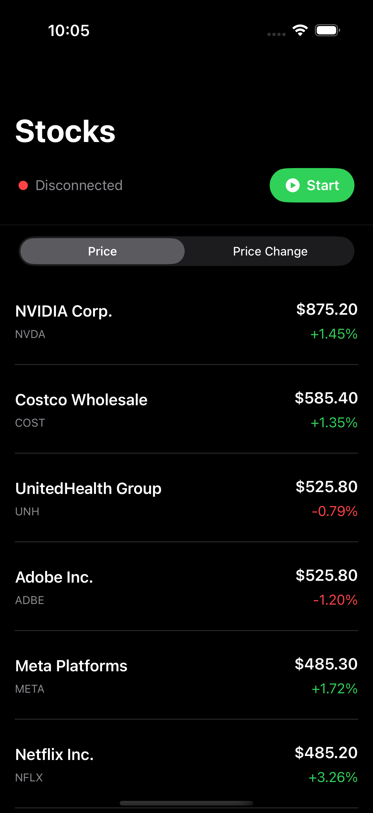
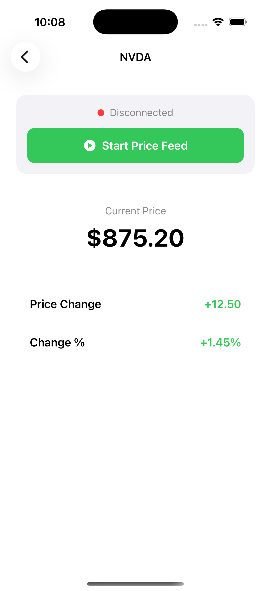
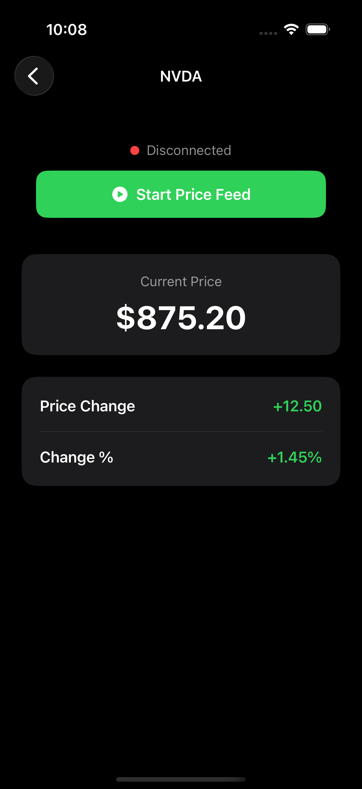

# Stock Price Tracker

A native iOS app that displays real-time stock prices for popular symbols. Built with SwiftUI, it features a clean interface with support for both **Light Mode** and **Dark Mode**, automatically adapting to your system appearance.

---

## Features

- **Real-time price updates** — Connect via WebSocket to receive live price changes for 25 stock symbols (NVDA, AAPL, GOOG, TSLA, META, and more)
- **Sortable list** — Sort by **Price** (highest first) or **Price Change** (biggest movers first)
- **Symbol details** — Tap any stock to view current price, price change, and change percentage
- **Connection control** — Start or stop the price feed with a single tap
- **System appearance** — Full support for Light Mode and Dark Mode with automatic color adaptation

---

## Screenshots

### Stocks List

| Light Mode | Dark Mode |
|:----------:|:---------:|
|  |  |

The main screen shows all tracked symbols with company name, ticker, current price, and daily change. The connection status (Disconnected / Connecting / Connected) and Start/Stop button are always visible at the top.

### Stock Detail

| Light Mode | Dark Mode |
|:----------:|:---------:|
|  |  |

Tap any symbol to see detailed price information: current price, price change amount, and change percentage. Green indicates positive movement; red indicates negative.

---

## Requirements

- **iOS 17.0+**
- **Xcode 15.0+**
- **Swift 5.9+**

---

## Getting Started

### 1. Clone the repository

```bash
git clone <repository-url>
cd Stock-Price-Tracker
```

### 2. Open in Xcode

```bash
open StockTracker/StockTracker.xcodeproj
```

### 3. Run the app

Select a simulator or device and press **⌘R** to build and run.

### 4. Start the price feed

Tap the green **Start** button to connect and begin receiving real-time price updates. Tap **Stop** when you want to pause the feed.

---

## Project Structure

```
StockTracker/
├── StockTracker/
│   ├── View/           # SwiftUI views (SymbolsListView, SymbolDetailView, etc.)
│   ├── ViewModel/      # View models (SymbolsListViewModel, SymbolDetailViewModel)
│   ├── Model/          # Data models (StockSymbol)
│   └── Service/        # Price feed service (WebSocket connection)
├── StockTrackerTests/  # Unit tests
└── StockTrackerUITests/# UI tests
```

---

## Testing

- **Unit tests**: Run with **⌘U** in Xcode, or `xcodebuild test -scheme StockTracker`
- **UI tests**: Included in the test suite; cover list display, navigation, sort picker, and detail view

---

## Architecture

- **SwiftUI** for declarative UI
- **Combine** for reactive data flow
- **MVVM** pattern with view models
- **Protocol-based** design for testability (e.g., `PriceFeedServiceProtocol`)

---

## License

This Project is an iOS assessment.
